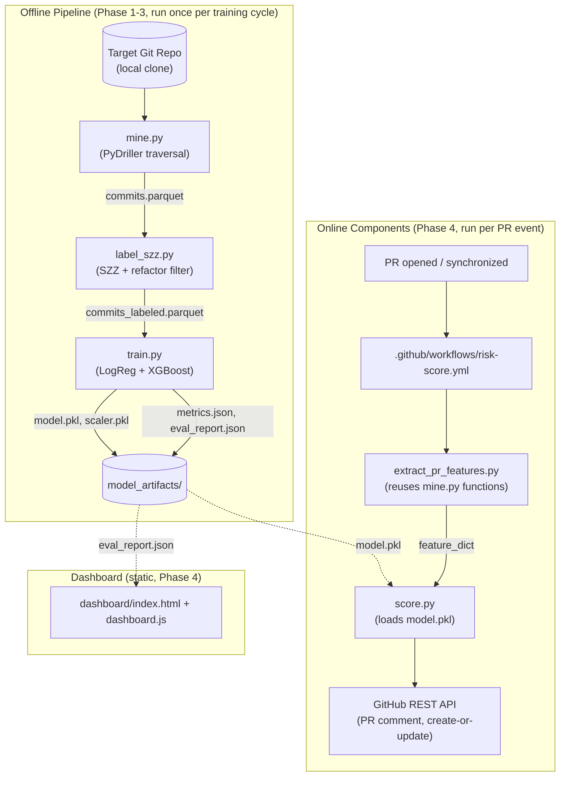

# implementation.md — Just-in-Time (JIT) Defect Risk Predictor

**Document status**: Source of truth for implementation. Supersedes the separate `project_overview.md` and `architecture.md` drafts — this file is self-contained.
**Audience**: any engineer implementing this system from scratch, with no prior context beyond this document.

---

## 1. Project Overview

### 1.1 Purpose

Reviewers cannot tell, at PR-open time, which commits are statistically likely to introduce a defect. This project builds a **Just-In-Time (JIT) Software Defect Prediction** system: a classifier trained on commit-level change metadata (not static code metrics) that scores incoming pull requests for defect risk and comments the score directly on the PR. The methodology follows Kamei et al. (2013), *"A Large-Scale Empirical Study of Just-in-Time Quality Assurance,"* for feature design, and the SZZ algorithm (Śliwerski, Zimmermann, Zeller, 2005) for labeling training data.

### 1.2 Scope

**In scope:**
- Mining one fixed open-source Git repository's commit history via PyDriller.
- Labeling commits as bug-inducing via SZZ (with a refactoring filter to reduce false positives).
- Training and selecting between Logistic Regression and XGBoost classifiers.
- A GitHub Action that scores new/updated PRs and posts a risk-score comment.
- A static dashboard reporting the trained model's precision, recall, AUC, F1, and confusion matrix on the evaluation repo.

**Out of scope (rationale in §14):**
- Static code analysis / AST-level complexity metrics.
- Multi-repo or cross-project transfer learning.
- Automatic PR blocking or required-status-check gating.
- Real-time/per-PR model retraining (retraining is a manual batch job — §8, Phase 5).
- Non-Git version control systems.

### 1.3 Success Criteria

| ID | Criterion | Threshold | Measured By |
|---|---|---|---|
| SC1 | Model discriminative power | AUC ≥ 0.65 on chronological held-out test set | `model_artifacts/metrics.json.selected_model.auc` |
| SC2 | Labeled dataset size | ≥ 2,000 total commits, ≥ 5% and ≤ 30% positive class rate | `data/commits_labeled.parquet` row count and mean of `is_bug_inducing` |
| SC3 | Action latency | Median PR comment posted within 60 seconds of workflow trigger | GitHub Actions run duration logs |
| SC4 | Action idempotency | A second push to the same PR edits the existing comment; it does not create a duplicate | Manual verification against a live test PR (§11.3) |
| SC5 | Dashboard accuracy | Dashboard-rendered metrics equal `model_artifacts/metrics.json` byte-for-byte at load time | Manual diff during acceptance testing |
| SC6 | Documentation completeness | README states exact AUC/precision/recall, repo name, and commit date range used | Manual review against Definition of Done (§8.6) |

A build that fails SC1 is not shippable in its current state; see §10.6 for the required remediation path (labeling review before hyperparameter tuning).

---

## 2. System Architecture

### 2.1 Component Diagram



### 2.2 Data Flow Description

1. **Mine**: `mine.py` traverses the target repo's commit history once, chronologically, producing one row per commit with JIT features (§6.1) — no target label yet.
2. **Label**: `label_szz.py` identifies bug-fix commits by message pattern, applies a refactoring filter, runs `git blame` against each fix's changed lines to find inducing commits, and joins the resulting `is_bug_inducing` label back onto the full commit set.
3. **Train**: `train.py` performs a chronological (not random) train/test split, trains both candidate models, evaluates both, and persists the higher-AUC model plus metrics artifacts.
4. **Serve (per PR)**: on `pull_request` events, `extract_pr_features.py` computes the identical feature schema for the new commits in the PR diff, using functions imported from `mine.py` to guarantee train/serve parity (§10.2). `score.py` loads the persisted model, computes a probability, and posts/updates a PR comment via the GitHub REST API.
5. **Report**: the dashboard is a static page that reads `model_artifacts/eval_report.json` directly — no backend, no live query path.

### 2.3 Component Responsibility Table

| Component | Responsibility | Does NOT Do |
|---|---|---|
| `mine.py` | Extract raw + derived features per commit | Labeling, training |
| `label_szz.py` | Identify fix commits, run SZZ, filter refactors, join labels | Feature extraction, training |
| `train.py` | Split, train, evaluate, select, persist | Mining, labeling, serving |
| `extract_pr_features.py` | Compute features for one PR's diff at score time | Full-repo re-mine, training |
| `score.py` | Load model, score, format comment, call GitHub API | Feature computation (delegates to `extract_pr_features.py`) |
| `dashboard.js` | Render persisted metrics | Compute metrics, call any API |

---

## 3. Tech Stack

| Layer | Choice | Rationale | Rejected Alternative(s) |
|---|---|---|---|
| Commit mining | PyDriller 2.x | Purpose-built Git-mining API with typed `Commit`/`ModifiedFile` objects; avoids hand-parsed `git log --numstat` output, which is brittle across Git versions | Raw `GitPython` + manual diff parsing — more code, more edge-case surface for the same result |
| SZZ / blame | Python `subprocess` calls to native `git blame` | PyDriller does not wrap `git blame`; shelling out to the system Git binary is more reliable than a pure-Python blame reimplementation and matches what reviewers can independently verify | `pydriller.git.Git.get_commits_last_modified_lines` — considered, but native `git blame -L` gives line-level provenance needed for the refactoring filter with less abstraction risk |
| Modeling | scikit-learn `LogisticRegression` + `xgboost.XGBClassifier` | Tabular, low-dimensional feature set (17 columns); both train in seconds on ≤10K rows; LR gives interpretable coefficients for the PR comment's "top factors," XGBoost gives a stronger nonlinear baseline | Deep learning (MLP/transformer) — unjustified for this data volume and feature dimensionality; would add training instability and interpretability loss for no measurable AUC gain at this scale |
| Data interchange | Apache Parquet (via `pyarrow`) | Typed columnar storage; avoids CSV dtype-inference bugs (e.g., commit hashes silently becoming floats); ~5-10x smaller than CSV at this row count | CSV — rejected due to dtype ambiguity; SQLite — rejected as unnecessary operational overhead for single-writer batch files |
| Action runtime | Python 3.11 on GitHub-hosted `ubuntu-latest` runner | Matches pipeline language exactly, zero infra to provision, `GITHUB_TOKEN` is auto-provisioned | Self-hosted runner — rejected, adds ops burden with no benefit for this workload's compute needs |
| PR comment delivery | GitHub REST API via `requests`, `Authorization: Bearer ${GITHUB_TOKEN}` | Direct control over create-vs-update comment logic | `actions/github-script` (JavaScript) — rejected to keep the entire codebase single-language |
| Dashboard | Static HTML + Chart.js (CDN), served via GitHub Pages | Metrics are produced once per batch training run — a static page reading a JSON file satisfies the requirement with zero backend, zero hosting cost, zero auth surface | Flask/FastAPI dashboard server — rejected as unnecessary; there is no live-query use case in v1 |
| Model persistence | `joblib.dump`/`joblib.load` | Standard for scikit-learn/XGBoost artifacts; produces a single portable file under 1MB for this feature/row count | ONNX export — rejected as unneeded complexity; no cross-language serving requirement exists |

---

## 4. Directory & File Structure

```
jit-defect-predictor/
├── README.md                          # Pitch, results table, setup, limitations (§8, Phase 5)
├── requirements.txt                   # Pinned dependency versions (§9.2)
├── .gitignore                         # Excludes data/*.parquet, __pycache__, .env
├── .github/
│   └── workflows/
│       └── risk-score.yml             # PR-triggered scoring workflow (§7.3)
├── pipeline/
│   ├── __init__.py
│   ├── config.py                      # REPO_URL, DATE_START, DATE_END, REPO_LOCAL_PATH, FIX_PATTERN_REGEX (§9.1)
│   ├── mine.py                        # Feature extraction functions (imported by extract_pr_features.py)
│   ├── label_szz.py                   # SZZ labeling logic
│   └── train.py                       # Split, train, evaluate, persist
├── action/
│   ├── __init__.py
│   ├── extract_pr_features.py         # Per-PR feature extraction (imports pipeline.mine)
│   └── score.py                       # Load model, score, format + post comment
├── dashboard/
│   ├── index.html                     # Static page shell
│   ├── dashboard.js                   # Fetches and renders eval_report.json
│   └── style.css
├── data/                               # Gitignored except .gitkeep
│   ├── .gitkeep
│   ├── commits.parquet                # Output of mine.py
│   └── commits_labeled.parquet        # Output of label_szz.py
├── model_artifacts/                    # Committed to repo (small, needed by the Action at runtime)
│   ├── model.pkl
│   ├── scaler.pkl                     # Present only if LogisticRegression was selected; absent if XGBoost was selected
│   ├── metrics.json
│   ├── eval_report.json
│   └── feature_importance.json
└── tests/
    ├── __init__.py
    ├── fixtures/
    │   └── sample_commits.py          # In-memory fixture objects, no network/repo dependency
    ├── test_mine.py
    ├── test_label_szz.py
    ├── test_train.py
    └── test_score.py
```

**Naming conventions (apply uniformly across the codebase):**
- Python files/functions/variables: `snake_case`.
- Python classes: `PascalCase` (none required in v1 — the codebase is function-based by design; introduce classes only if state genuinely needs encapsulation, e.g., a future `FeatureExtractor` class).
- JSON keys: `snake_case`, matching the Python dict keys that produce them.
- Directories: `kebab-case` for the repo root name, `snake_case` for Python packages (`pipeline`, `action`), plain lowercase for non-package directories (`data`, `dashboard`, `model_artifacts`, `tests`).
- Environment variables: `SCREAMING_SNAKE_CASE` (§9.1).

---

## 5. Core Modules

### 5.1 `pipeline/config.py`

**Responsibility**: single source of truth for repo target, date range, and regex patterns. No functions — module-level constants only.

**Interface (module-level constants, all required, no defaults):**
```python
REPO_URL: str            # e.g. "https://github.com/apache/commons-lang.git"
REPO_LOCAL_PATH: str     # e.g. "data/target_repo"
DATE_START: datetime     # timezone-aware, UTC
DATE_END: datetime       # timezone-aware, UTC
FIX_PATTERN_REGEX: str   # e.g. r"\b(fix|fixes|fixed|bug|defect|resolve[sd]?)\b|LANG-\d+"
REFACTOR_FILTER_THRESHOLD: float  # default 0.8; fraction of whitespace/comment-only lines above which a fix commit is excluded from SZZ
```

### 5.2 `pipeline/mine.py`

**Responsibility**: walk commit history and compute the full JIT feature schema (§6.1) per commit, using only information available as of that commit (no look-ahead).

**Interface:**
```python
def mine_commits(repo_path: str, since: datetime, to: datetime) -> pd.DataFrame:
    """
    Inputs:
        repo_path: local filesystem path to a full (non-shallow) clone.
        since, to: timezone-aware UTC bounds, inclusive.
    Output:
        DataFrame with columns exactly matching the schema in §6.1
        (commit_hash, author_date, author_email, msg, plus all 17 feature
        columns), one row per commit, sorted ascending by author_date.
    Raises:
        FileNotFoundError if repo_path does not contain a .git directory.
        ValueError if since >= to.
    """

def compute_commit_features(commit: "pydriller.Commit", author_state: dict, file_state: dict) -> dict:
    """
    Pure function: computes one commit's feature row given the commit object
    and the running author/file state dictionaries (mutated in place by the
    caller AFTER this function returns, not before — this function only reads
    state as of before the current commit).
    This function is the one imported by action/extract_pr_features.py to
    guarantee train/serve parity (§10.2). Do not duplicate its logic anywhere.
    Returns: dict with keys matching all 17 feature names in §6.1.
    """
```

### 5.3 `pipeline/label_szz.py`

**Responsibility**: identify bug-fix commits, filter cosmetic-only fixes, run SZZ blame, join labels onto the mined commit set.

**Interface:**
```python
def identify_fix_commits(commits_df: pd.DataFrame, pattern: str) -> pd.DataFrame:
    """Returns the subset of commits_df whose `msg` matches `pattern` (case-insensitive)."""

def apply_refactoring_filter(fix_commits_df: pd.DataFrame, repo_path: str, threshold: float) -> pd.DataFrame:
    """
    For each fix commit, computes (whitespace_lines + comment_only_lines) / total_changed_lines
    from its diff. Drops rows where this ratio exceeds `threshold`.
    Returns the filtered DataFrame (same columns as input, fewer rows).
    """

def run_szz(fix_commits_df: pd.DataFrame, repo_path: str) -> pd.DataFrame:
    """
    For each fix commit, for each changed line, runs:
        git blame -L <line>,<line> <fix_commit_hash>^ -- <file_path>
    to find the last commit that touched that line before the fix.
    Returns DataFrame with columns [inducing_commit_hash, fix_commit_hash],
    deduplicated on (inducing_commit_hash, fix_commit_hash) pairs.
    """

def label_commits(commits_df: pd.DataFrame, inducing_pairs_df: pd.DataFrame) -> pd.DataFrame:
    """
    Left-joins commits_df with inducing_pairs_df on commit_hash == inducing_commit_hash.
    Adds column `is_bug_inducing` (int8, 0 or 1) and `fix_commit_hash` (nullable str).
    Returns full commits_df with these two columns added, row count unchanged.
    """
```

### 5.4 `pipeline/train.py`

**Responsibility**: chronological split, dual-model training, evaluation, model selection, artifact persistence.

**Interface:**
```python
def chronological_split(df: pd.DataFrame, date_col: str, train_frac: float) -> tuple[pd.DataFrame, pd.DataFrame]:
    """Sorts by date_col ascending. Returns (train_df, test_df) with train_df = first train_frac rows."""

def train_logistic_regression(X_train: pd.DataFrame, y_train: pd.Series) -> tuple["LogisticRegression", "StandardScaler"]:
    """Fits StandardScaler on X_train, then LogisticRegression(class_weight="balanced", max_iter=1000) on scaled features."""

def train_xgboost(X_train: pd.DataFrame, y_train: pd.Series) -> "XGBClassifier":
    """scale_pos_weight = (y_train == 0).sum() / (y_train == 1).sum(); XGBClassifier(scale_pos_weight=..., eval_metric="auc")."""

def evaluate(model, X_test: pd.DataFrame, y_test: pd.Series, scaler: "StandardScaler | None") -> dict:
    """
    Returns:
        {
          "auc": float,
          "precision_at_0.5": float,
          "recall_at_0.5": float,
          "f1_at_0.5": float,
          "best_f1_threshold": float,
          "precision_at_best_threshold": float,
          "recall_at_best_threshold": float,
          "f1_at_best_threshold": float,
          "confusion_matrix": [[int, int], [int, int]],
          "n_test": int,
          "positive_rate_test": float
        }
    """

def select_and_persist_best(lr_model, scaler, lr_metrics: dict, xgb_model, xgb_metrics: dict, output_dir: str) -> str:
    """
    Selects the model with higher "auc". Persists model.pkl, scaler.pkl (LR only),
    metrics.json (both models' full metrics + "selected_model" key), and
    feature_importance.json. Returns the selected model's name ("logistic_regression" or "xgboost").
    """
```

### 5.5 `action/extract_pr_features.py`

**Responsibility**: compute the feature row for the PR's head commit(s) at score time, scoped to the PR diff plus the author's prior history in the checked-out repo.

**Interface:**
```python
def extract_features_for_pr(repo_path: str, base_sha: str, head_sha: str, author_login: str) -> dict:
    """
    Inputs:
        repo_path: path to the checked-out repo (must be fetch-depth: 0).
        base_sha, head_sha: full 40-character commit SHAs.
        author_login: GitHub username of the PR author (mapped to git author email
                      via `git log -1 --format=%ae <head_sha>`).
    Output:
        dict with the same 17 feature keys as pipeline.mine.compute_commit_features,
        computed by calling that exact function against the head_sha commit,
        with author_state/file_state rebuilt from repo history up to head_sha.
    Raises:
        subprocess.CalledProcessError if git commands fail (propagated, not swallowed —
        see §10.3 for why the Action must fail loudly rather than post a silent default score).
    """
```

### 5.6 `action/score.py`

**Responsibility**: load the persisted model, score the extracted features, format and post/update the PR comment.

**Interface:**
```python
def load_model(model_path: str, scaler_path: str | None) -> tuple[object, object | None]:
    """joblib.load both paths; scaler_path may be None if XGBoost was the selected model."""

def predict_risk(model, features: dict, scaler: object | None, feature_order: list[str]) -> float:
    """
    Orders features dict values according to feature_order (loaded from
    metrics.json's "feature_columns" list — never hardcoded, to keep train/serve
    column order in sync). Scales if scaler is not None. Returns model.predict_proba(X)[0][1].
    """

def format_comment(risk_score: float, top_factors: list[tuple[str, float]], thresholds: dict) -> str:
    """
    thresholds: {"low_max": float, "medium_max": float} loaded from metrics.json's
    test-set score distribution (33rd/66th percentile of test predictions — not
    hardcoded 0.3/0.6). Returns a Markdown string containing the HTML marker
    "<!-- jit-risk-bot -->" as its first line.
    """

def post_or_update_comment(github_token: str, repo: str, pr_number: int, body: str) -> None:
    """
    GET /repos/{repo}/issues/{pr_number}/comments, scan for a comment whose body
    starts with "<!-- jit-risk-bot -->". If found, PATCH /repos/{repo}/issues/comments/{id}.
    If not found, POST /repos/{repo}/issues/{pr_number}/comments.
    Raises requests.HTTPError on any non-2xx response (not caught here — see §10.3).
    """
```

### 5.7 `dashboard/dashboard.js`

**Responsibility**: fetch `model_artifacts/eval_report.json` and render it. No computation, no state beyond the fetched JSON.

**Interface (JS functions, documented for parity with the Python interfaces above):**
```javascript
async function loadEvalReport(path)       // returns parsed JSON or throws
function renderStatCards(report)           // AUC, precision, recall, F1 as cards
function renderConfusionMatrix(report)     // 2x2 table
function renderFeatureImportance(report)   // Chart.js horizontal bar
function renderFooter(report)              // trained_at, repo, commit_range, n_train, n_test
```

---

## 6. Data Models

### 6.1 `commits.parquet` / `commits_labeled.parquet` Schema

| Column | Type | Nullable | Description | Validation Rule |
|---|---|---|---|---|
| `commit_hash` | string (40 char hex) | No | Full Git SHA | Must match `^[a-f0-9]{40}$` |
| `author_date` | timestamp (UTC) | No | Commit author timestamp | Must fall within `[DATE_START, DATE_END]` |
| `author_email` | string | No | Commit author's email | Non-empty |
| `msg` | string | No | Full commit message | May be empty string (not null) for malformed commits |
| `la` | int32 | No | Lines added | ≥ 0 |
| `ld` | int32 | No | Lines deleted | ≥ 0 |
| `lt` | int32 | No | Total lines in touched files, pre-change | ≥ 0 |
| `nf` | int32 | No | Number of files touched | ≥ 1 |
| `ns` | int32 | No | Number of subsystems (top-level dirs) touched | ≥ 1 |
| `nd` | int32 | No | Number of directories touched | ≥ 1 |
| `entropy` | float64 | No | Shannon entropy of change distribution across files | ≥ 0.0; equals 0.0 when `nf == 1` |
| `ndev` | int32 | No | Distinct prior developers on touched files | ≥ 0 (0 for files never touched before) |
| `age` | float64 | No | Mean days since touched files last changed | ≥ 0.0; 0.0 for files touched for the first time (cold start) |
| `nuc` | int32 | No | Prior unique changes to touched files | ≥ 0 |
| `exp` | int32 | No | Author's total prior commit count | ≥ 0 |
| `rexp` | float64 | No | Author's recency-weighted prior commit count | ≥ 0.0 |
| `sexp` | float64 | No | Author's prior commit count in this subsystem | ≥ 0.0 |
| `fix_ratio_author` | float64 | No | Author's prior (fix commits / total commits) | 0.0 ≤ value ≤ 1.0; 0.0 for an author's first commit |
| `hour_of_day` | int8 | No | Commit hour (0-23), author-local timezone if available else UTC | 0 ≤ value ≤ 23 |
| `is_weekend` | bool | No | True if commit made on Sat/Sun | — |
| `msg_entropy` | float64 | No | Character-level Shannon entropy of `msg` | ≥ 0.0; 0.0 for empty `msg` |
| `msg_length` | int32 | No | Character length of `msg` | ≥ 0 |
| `is_bug_inducing` | int8 | Present only in `commits_labeled.parquet` | Target label | 0 or 1 |
| `fix_commit_hash` | string (40 char hex) | Yes | The fix commit that led to this label (null if `is_bug_inducing == 0`) | Must match `^[a-f0-9]{40}$` when present |

**Relationships**: `fix_commit_hash` is a self-referential foreign key into `commit_hash` within the same table — every non-null `fix_commit_hash` must exist as a `commit_hash` value elsewhere in the same file. Validated in `tests/test_label_szz.py` (§11.1).

### 6.2 `model_artifacts/metrics.json` Schema

```json
{
  "trained_at": "ISO-8601 UTC timestamp",
  "repo": "string, e.g. apache/commons-lang",
  "commit_range": {"start": "ISO-8601 date", "end": "ISO-8601 date"},
  "n_train": "int",
  "n_test": "int",
  "positive_rate_train": "float, 0.0-1.0",
  "positive_rate_test": "float, 0.0-1.0",
  "feature_columns": ["ordered list of the 17 feature column names, defines serving-time column order"],
  "logistic_regression": { "...evaluate() output dict, §5.4..." },
  "xgboost": { "...evaluate() output dict, §5.4..." },
  "selected_model": "logistic_regression | xgboost",
  "score_distribution_test": {"p33": "float", "p66": "float"}
}
```

**Validation rule**: `selected_model` must equal whichever of `logistic_regression.auc` / `xgboost.auc` is numerically higher — asserted in `tests/test_train.py`, not just produced by convention.

### 6.3 `model_artifacts/eval_report.json` Schema

Strict subset of `metrics.json`, denormalized for dashboard consumption (dashboard must not need to know about the two-model comparison, only the winner):

```json
{
  "trained_at": "ISO-8601 UTC timestamp",
  "repo": "string",
  "commit_range": {"start": "ISO-8601 date", "end": "ISO-8601 date"},
  "n_train": "int",
  "n_test": "int",
  "selected_model": "logistic_regression | xgboost",
  "auc": "float",
  "precision_at_0.5": "float",
  "recall_at_0.5": "float",
  "f1_at_0.5": "float",
  "confusion_matrix": [["int", "int"], ["int", "int"]]
}
```

### 6.4 `model_artifacts/feature_importance.json` Schema

```json
[
  {"feature": "string, one of the 17 feature names", "importance": "float, absolute magnitude, sorted descending"}
]
```

**Validation rule**: array length must equal 17 (one entry per feature column in §6.1); all `feature` values must be a subset of `metrics.json.feature_columns`.

---

## 7. API / Interface Contracts

### 7.1 Internal Python Function Contracts

Specified in full in §5 (Core Modules), including input types, output types, and raised exceptions. This section covers the **external-facing** interfaces only: the GitHub REST API calls the system makes, and the GitHub Actions workflow's I/O contract.

### 7.2 GitHub REST API Usage (outbound calls made by `action/score.py`)

| Call | Method + Endpoint | Auth | Purpose |
|---|---|---|---|
| List PR comments | `GET /repos/{owner}/{repo}/issues/{pr_number}/comments` | `Authorization: Bearer $GITHUB_TOKEN` | Locate an existing bot comment by marker string |
| Create comment | `POST /repos/{owner}/{repo}/issues/{pr_number}/comments` body `{"body": "<markdown string>"}` | `Authorization: Bearer $GITHUB_TOKEN` | Post the risk score when no prior bot comment exists |
| Update comment | `PATCH /repos/{owner}/{repo}/issues/comments/{comment_id}` body `{"body": "<markdown string>"}` | `Authorization: Bearer $GITHUB_TOKEN` | Update the risk score when a prior bot comment exists (idempotency, SC4) |

All three calls use `requests`, `timeout=10` seconds, and raise on non-2xx via `response.raise_for_status()`.

### 7.3 GitHub Actions Workflow Contract (`.github/workflows/risk-score.yml`)

**Trigger**: `pull_request` events `[opened, synchronize]`.

**Required inputs (from GitHub Actions context, no manual configuration needed)**:
- `github.event.pull_request.number` → `PR_NUMBER`
- `github.event.pull_request.base.sha` → `BASE_SHA`
- `github.event.pull_request.head.sha` → `HEAD_SHA`
- `github.event.pull_request.user.login` → `PR_AUTHOR`
- `github.repository` → `REPO`
- `secrets.GITHUB_TOKEN` → `GITHUB_TOKEN` (auto-provisioned, no manual secret setup)

**Required permissions block:**
```yaml
permissions:
  pull-requests: write
  contents: read
```

**Full workflow definition:**
```yaml
name: JIT Defect Risk Score
on:
  pull_request:
    types: [opened, synchronize]

permissions:
  pull-requests: write
  contents: read

jobs:
  score:
    runs-on: ubuntu-latest
    steps:
      - uses: actions/checkout@v4
        with:
          fetch-depth: 0
      - uses: actions/setup-python@v5
        with:
          python-version: "3.11"
      - run: pip install -r requirements.txt
      - name: Extract features and score PR
        env:
          GITHUB_TOKEN: ${{ secrets.GITHUB_TOKEN }}
          PR_NUMBER: ${{ github.event.pull_request.number }}
          BASE_SHA: ${{ github.event.pull_request.base.sha }}
          HEAD_SHA: ${{ github.event.pull_request.head.sha }}
          PR_AUTHOR: ${{ github.event.pull_request.user.login }}
          REPO: ${{ github.repository }}
        run: python action/score.py
```

**Output contract**: `action/score.py` exits 0 on successful comment post/update, exits 1 on any unrecoverable error (propagated exception — see §10.3). It writes no files; its only side effect is the PR comment via §7.2.

---

## 8. Implementation Phases

Phases are strictly ordered. Each phase's deliverables are the explicit entry criteria for the next phase — do not begin a phase until the prior phase's deliverables are met.

### Phase 0 — Repository Selection & Setup
**Dependencies**: none.
**Tasks**:
1. Install dependencies: `pip install -r requirements.txt` (§9.2).
2. Run the linkage-density probe against candidate repo #1 (`apache/commons-lang`):
   ```bash
   git clone --depth 5000 https://github.com/apache/commons-lang.git /tmp/probe
   cd /tmp/probe && git log --oneline | grep -icE "fix|bug|LANG-[0-9]+"
   ```
3. If `(match_count / 5000) < 0.08`, repeat the probe against the fallback candidate (a mid-size JS repo with strict Conventional Commits history, e.g. `axios/axios`).
4. Full-clone the selected repo to `data/target_repo` (non-shallow — required for `git blame` in Phase 2).
5. Populate `pipeline/config.py` with `REPO_URL`, `REPO_LOCAL_PATH`, `DATE_START`, `DATE_END` (fixed for the remainder of the build — see §14, Assumption A1).

**Deliverables**: `pipeline/config.py` fully populated; `data/target_repo/.git` exists and is a full clone.

### Phase 1 — Mining
**Dependencies**: Phase 0 complete.
**Tasks**: implement and run `pipeline/mine.py` per the contract in §5.2.
**Deliverables**: `data/commits.parquet` exists, row count ≥ 2,000 (SC2), schema matches §6.1 minus the labeling columns, validated by `tests/test_mine.py`.

### Phase 2 — Labeling
**Dependencies**: Phase 1 complete.
**Tasks**: implement and run `pipeline/label_szz.py` per the contract in §5.3.
**Deliverables**: `data/commits_labeled.parquet` exists, positive class rate between 5% and 30% (SC2), `fix_commit_hash` foreign-key relationship validated (§6.1), validated by `tests/test_label_szz.py`.

### Phase 3 — Training
**Dependencies**: Phase 2 complete.
**Tasks**: implement and run `pipeline/train.py` per the contract in §5.4.
**Deliverables**: `model_artifacts/{model.pkl, metrics.json, eval_report.json, feature_importance.json}` exist; `metrics.json.selected_model`'s AUC ≥ 0.65 (SC1). **This is a hard gate — do not proceed to Phase 4 if SC1 is unmet.** Remediation path: §10.6.

### Phase 4 — Action & Dashboard Integration
**Dependencies**: Phase 3 complete (specifically, `model_artifacts/` must contain a passing model).
**Tasks**:
1. Implement `action/extract_pr_features.py` and `action/score.py` per §5.5–5.6.
2. Implement `.github/workflows/risk-score.yml` per §7.3.
3. Implement `dashboard/index.html`, `dashboard.js`, `style.css` per §5.7.
4. Enable GitHub Pages on the repo (Settings → Pages → source: `/dashboard` on the default branch).
**Deliverables**: a live test PR against the repo receives a bot comment within 60 seconds (SC3); a second push to that PR edits rather than duplicates the comment (SC4); the dashboard is reachable at the Pages URL and its rendered numbers equal `eval_report.json` (SC5).

### Phase 5 — Documentation
**Dependencies**: Phase 4 complete.
**Tasks**: write `README.md` containing, in order: pitch with citations, results table (exact numbers from `metrics.json`), architecture diagram, feature explanation, setup instructions, Limitations section, license and citations.
**Deliverables**: SC6 met; Definition of Done (§8.6) fully checked.

### 8.6 Definition of Done (all items required, no partial credit)

- [ ] SC1–SC6 all met (§1.3).
- [ ] `tests/` suite passes with zero failures (§11).
- [ ] `pipeline/config.py`'s `DATE_START`/`DATE_END`/`REPO_URL` match exactly what is stated in `README.md`.
- [ ] `action/extract_pr_features.py` imports feature functions from `pipeline/mine.py` — verified by code review, not just by test passing (a test could pass with duplicated logic that happens to agree at test time but drifts later; the import itself is the guarantee).
- [ ] `model_artifacts/scaler.pkl` is present if and only if `selected_model == "logistic_regression"`.

---

## 9. Configuration & Environment

### 9.1 Environment Variables

| Variable | Required In | Purpose | Example |
|---|---|---|---|
| `GITHUB_TOKEN` | GitHub Actions runtime only (auto-provisioned by `secrets.GITHUB_TOKEN`) | Bearer auth for PR comment API calls | (opaque, never logged) |
| `PR_NUMBER` | GitHub Actions runtime only | Target PR for comment posting | `"42"` |
| `BASE_SHA` | GitHub Actions runtime only | Diff base for feature extraction | `"a1b2c3..."` |
| `HEAD_SHA` | GitHub Actions runtime only | Diff head for feature extraction | `"d4e5f6..."` |
| `PR_AUTHOR` | GitHub Actions runtime only | GitHub login, mapped to git author email | `"octocat"` |
| `REPO` | GitHub Actions runtime only | `owner/repo` string for API calls | `"apache/commons-lang"` |

No environment variables are required for local Phase 0–3 execution — `pipeline/config.py` module constants are used instead (config-as-code, not config-as-env, for the offline pipeline, since it runs on a developer machine with no secrets involved).

### 9.2 `requirements.txt` (pinned)

```
pydriller==2.6
pandas==2.2.2
pyarrow==16.1.0
scikit-learn==1.5.0
xgboost==2.0.3
requests==2.32.3
joblib==1.4.2
pytest==8.2.2
```

Exact patch versions are pinned to guarantee reproducibility of SC1's reported AUC — an unpinned `scikit-learn` upgrade between training and Action-runtime execution could silently change model behavior.

### 9.3 Secrets Management

- The only secret in this system is `GITHUB_TOKEN`, and it is never manually created, stored, or rotated — it is GitHub Actions' auto-provisioned, run-scoped token, injected via `secrets.GITHUB_TOKEN` and expiring at the end of each workflow run.
- No API keys, database credentials, or long-lived tokens exist anywhere in this system's design. This is a direct consequence of the architecture decision in §3 to avoid a backend/database.
- `model_artifacts/*.pkl` files contain no secrets or PII — they are serialized scikit-learn/XGBoost model objects trained on commit metadata (hashes, timestamps, line counts), not raw source code or personal data beyond publicly-visible Git author emails already present in the public repo's history.

### 9.4 Local Development Config

No `.env` file is used. `pipeline/config.py` is committed to the repo (it contains no secrets — only the target repo URL and date range, all public information) and is the single edit point for retargeting the pipeline at a different repo or date window.

---

## 10. Error Handling & Edge Cases

| # | Failure Mode | Where It Occurs | Handling Strategy |
|---|---|---|---|
| 10.1 | Target repo has renamed/moved files across history | `mine.py`, `label_szz.py` | PyDriller's `ModifiedFile.old_path`/`new_path` are used to track renames; `git blame` in `label_szz.py` is invoked with `--follow` to trace lines through renames. If `--follow` still fails to resolve a line's origin (file deleted before the fix), that line is excluded from the blame result for that fix commit rather than aborting the whole SZZ run. |
| 10.2 | Train/serve feature skew (offline features computed differently than online features) | `action/extract_pr_features.py` | Structurally prevented, not just tested: `extract_pr_features.py` imports `compute_commit_features` directly from `pipeline/mine.py` (§5.5). Code review must reject any PR that reimplements feature logic instead of importing it. |
| 10.3 | GitHub API call fails (rate limit, network error, invalid token) | `action/score.py` §7.2 | Exceptions are **not caught and suppressed** — `score.py` allows `requests.HTTPError`/`ConnectionError` to propagate, causing the Action step to fail with a visible red X in the PR checks UI. Rationale: a silently-skipped risk comment is worse than a visibly-failed Action, because the former looks like "this PR was scored low-risk" when it was not scored at all. |
| 10.4 | Model file missing or corrupted at Action runtime | `action/score.py` `load_model()` | `joblib.load` raises `FileNotFoundError` or `EOFError`, which propagates and fails the Action step (same rationale as 10.3 — no silent fallback score). |
| 10.5 | Empty or malformed commit message | `mine.py` (`msg_entropy`, `msg_length`), `label_szz.py` (`identify_fix_commits`) | Empty string is a valid input to the Shannon-entropy function (`msg_entropy = 0.0`, `msg_length = 0`); regex matching against an empty string simply does not match any fix pattern (correct behavior, not an error). |
| 10.6 | AUC below 0.65 threshold (SC1) after Phase 3 | `train.py` evaluation | **Not treated as a modeling problem first.** Remediation order: (1) re-verify `FIX_PATTERN_REGEX` in `pipeline/config.py` catches the target repo's actual fix-commit convention (spot-check 20 commits manually); (2) re-verify `REFACTOR_FILTER_THRESHOLD` is not filtering out genuine bug fixes; (3) only after (1) and (2) are confirmed correct, consider hyperparameter tuning (XGBoost `max_depth`/`n_estimators`, LR `C`) as the last resort. |
| 10.7 | Extreme class imbalance (positive rate < 5%) discovered after Phase 2 | `label_szz.py` output | Do not proceed to Phase 3. Re-check `FIX_PATTERN_REGEX` for over-restrictiveness (e.g., missing the repo's actual issue-ID convention) before adjusting `train.py`'s class weighting — a data problem should not be papered over with model-side compensation. |
| 10.8 | PR from a fork with a shallow or restricted checkout | `.github/workflows/risk-score.yml`, `extract_pr_features.py` | `fetch-depth: 0` in the checkout step (§7.3) ensures full history is available regardless of fork status; `pull_request` (not `pull_request_target`) trigger is used deliberately so the workflow runs with the PR's own code and the fork's read access only, avoiding secret exposure to untrusted fork code (see §12.3). |
| 10.9 | Author's first-ever commit in the mined window (cold start for `exp`, `rexp`, `sexp`, `age`, `ndev`, `fix_ratio_author`) | `mine.py` running state initialization | Explicitly defined as zero-valued, not null and not imputed via mean/median — this is a real, meaningful state ("this author/file has no history yet"), not missing data. Documented in §6.1's validation rules. |
| 10.10 | Duplicate bot comments from a race condition (two workflow runs on rapid successive pushes) | `action/score.py` `post_or_update_comment()` | Accepted risk in v1: GitHub Actions does not guarantee run ordering for rapid `synchronize` events. Mitigation if observed in practice: add `concurrency: group: risk-score-${{ github.event.pull_request.number }}, cancel-in-progress: true` to the workflow — a Phase 4 follow-up, not blocking initial delivery. |

---

## 11. Testing Strategy

### 11.1 Unit Tests

| Test File | Target | Cases Covered |
|---|---|---|
| `tests/test_mine.py` | `compute_commit_features` | Entropy calculation against hand-computed values for a 3-file synthetic commit; cold-start imputation (`exp=0`, `age=0.0`, etc. per §10.9) for a synthetic first-time author; `hour_of_day` boundary values (0 and 23); empty commit message handling |
| `tests/test_label_szz.py` | `identify_fix_commits`, `apply_refactoring_filter`, `label_commits` | Regex matches on fixture commit messages including true positives, true negatives, and near-miss decoys (e.g., "bugfoot" should not match `\bbug\b`); refactoring filter correctly excludes a synthetic 95%-whitespace diff and correctly retains a synthetic 20%-whitespace diff; `label_commits` produces the correct row count (unchanged from input) and correct `fix_commit_hash` foreign-key values |
| `tests/test_train.py` | `chronological_split`, `evaluate`, `select_and_persist_best` | Split produces no date overlap between train/test and exact `train_frac` proportion (±1 row for rounding); `evaluate` output dict has all keys specified in §5.4 with correct types; `select_and_persist_best` picks the higher-AUC model given two synthetic metrics dicts with known AUCs |
| `tests/test_score.py` | `format_comment`, `predict_risk`, `post_or_update_comment` | `format_comment` output starts with the exact marker string; risk band boundaries match the `thresholds` dict passed in (not hardcoded); `predict_risk` orders features per `feature_order` before calling `predict_proba` (verified via a mock model asserting input column order); `post_or_update_comment` is tested against a mocked `requests` session — real network calls are never made in tests |

**Fixture policy**: all unit tests use in-memory fixture objects (`tests/fixtures/sample_commits.py` — plain dicts or lightweight dataclasses mimicking `pydriller.Commit`'s relevant attributes). No test requires a network connection or a live repo clone.

### 11.2 Integration Tests

- **Pipeline integration**: run `mine.py` → `label_szz.py` → `train.py` end-to-end against a small (~50-commit) real local test repo checked into `tests/fixtures/` as a `.git` bundle (`git bundle create`/`git clone` from bundle), asserting the full chain produces a non-empty, schema-valid `commits_labeled.parquet` and a `metrics.json` with all required keys. This does not assert AUC ≥ 0.65 (too small a sample for that threshold to be meaningful) — it asserts structural correctness only.
- **Action integration (local)**: `extract_pr_features.py` is run against two commits within the same small test-repo bundle (simulating `base_sha`/`head_sha`) and its output dict is asserted to have identical keys and types to a `mine.py`-produced row for the same commit — this is the direct test of the train/serve-parity guarantee in §10.2.

### 11.3 End-to-End (E2E) Test

- **Manual, one-time, pre-launch**: open a real PR against a fork of the target repo (or a disposable test repo with the workflow installed), verify:
  1. The workflow triggers on `opened`.
  2. A comment appears within 60 seconds containing a risk score and top factors (SC3).
  3. Pushing an additional commit triggers `synchronize` and **edits** the existing comment (SC4) — verified by comment ID staying constant across the two workflow runs (visible in the GitHub UI's comment edit history).
  4. The dashboard, loaded fresh in a browser with cache disabled, shows numbers matching `eval_report.json` (SC5).
- This E2E check is not automated in v1 (no CI-of-CI infrastructure is justified at this scope) but must be performed and its result recorded before Phase 5 documentation is finalized.

---

## 12. Security Considerations

### 12.1 Authentication & Authorization

- The system has exactly one credential: the GitHub Actions `GITHUB_TOKEN`, auto-scoped per-run by GitHub, never manually issued.
- Workflow `permissions` block (§7.3) explicitly grants only `pull-requests: write` and `contents: read` — the minimum needed. It does **not** request `contents: write`, `issues: write`, or any admin scope.

### 12.2 Input Validation

- All Git-derived inputs (commit hashes, file paths, author emails) are treated as untrusted text when constructing `subprocess` calls: `subprocess.run([...], shell=False)` is used exclusively — **never `shell=True`, never f-string-interpolated shell commands** — to eliminate shell-injection risk from a maliciously-crafted commit message or file path in the mined repo's history.
- Commit hashes are validated against the regex `^[a-f0-9]{40}$` (§6.1) before being used in any subprocess call or file path construction.

### 12.3 Fork PR Safety

- The workflow trigger is `pull_request`, not `pull_request_target`. This is a deliberate security choice: `pull_request` runs with the fork's code but **without** access to repository secrets beyond the auto-scoped, run-limited `GITHUB_TOKEN`, and that token's write permission is limited to `pull-requests: write` (§12.1). A malicious fork PR cannot exfiltrate any secret of consequence, because none exists beyond this narrowly-scoped token.

### 12.4 Data Protection

- No PII beyond what is already public in the mined repo's Git history (author names/emails, already publicly visible to anyone who clones the repo) is collected, stored, or transmitted.
- `model_artifacts/*.pkl` and `*.json` files contain aggregate statistical model parameters and metrics — not raw commit content, not individual identifiable predictions tied to a specific person beyond what the public commit history already discloses.

### 12.5 Dependency Supply Chain

- `requirements.txt` pins exact versions (§9.2) to prevent an upstream dependency update from silently altering model behavior or introducing a compromised package version between development and Action runtime.

---

## 13. Performance & Scalability Notes

### 13.1 Known Bottlenecks

| Bottleneck | Location | Current Mitigation | Scaling Trigger |
|---|---|---|---|
| `git blame` calls, one per changed line per fix commit | `label_szz.py` `run_szz()` | Runs once, offline, during Phase 2 — not on the Action's critical path. Acceptable at the ≥2,000-commit scale (SC2) with a runtime of low single-digit minutes | If mined history grows beyond ~50,000 commits, batch `git blame` calls per file rather than per line (one blame call covering all changed line ranges in a file, not one call per line) |
| Full-repo history traversal | `mine.py` `mine_commits()` | Runs once per training cycle (batch), not per-PR | If retraining cadence increases to daily/hourly, cache per-author/per-file running state between runs instead of recomputing from `DATE_START` each time |
| Action per-PR feature extraction | `extract_pr_features.py` | Scoped to only the PR's diff + author's history in the checked-out repo — deliberately not a full re-mine (§2.2 step 4) — keeps this on the order of seconds | If applied to a monorepo with very large individual diffs, cap the number of changed lines processed per file for `entropy`/`la`/`ld` computation rather than processing unboundedly |
| GitHub API rate limits | `action/score.py` §7.2 | `GITHUB_TOKEN` has a 1,000 requests/hour/repo limit for Actions-context tokens; this system makes at most 3 calls per PR event (list, then create-or-update) | Not expected to be reached at any realistic PR-event rate for a single repo; would only become relevant if this Action were deployed across many repos sharing one token, which is not this system's design |

### 13.2 Explicit Non-Optimizations (deliberate, scoped out)

- No caching layer for repeated feature computation — the row counts involved (thousands, not millions) do not justify the added complexity.
- No parallelization of the mining loop — PyDriller's traversal is inherently sequential per-commit (running state depends on commit order), and the total runtime at this scale (minutes) does not justify multiprocessing complexity.
- No model-serving latency optimization beyond "load a <1MB pickle file once per Action run" — this is already well within the 60-second budget (SC3) without further work.

### 13.3 Explicit Performance Targets

- Phase 1 (mining) + Phase 2 (labeling) combined offline runtime: under 15 minutes on a standard developer laptop for a ~2,000–10,000 commit window.
- Phase 3 (training) runtime: under 2 minutes for both models combined at this row/feature count.
- Per-PR Action runtime (checkout + extract + score + comment): under 60 seconds median (SC3), measured end-to-end from workflow trigger to comment API call completion.

---

## 14. Open Questions / Assumptions

Explicitly stated here, not left implicit in prose elsewhere in this document.

| ID | Type | Statement | Impact If Wrong |
|---|---|---|---|
| A1 | Assumption | `DATE_START`/`DATE_END`/`REPO_URL` in `pipeline/config.py`, once set in Phase 0, remain fixed for the entire build | Changing the repo or date range after Phase 2 labeling has started invalidates SZZ linkage work already completed and requires restarting from Phase 1 |
| A2 | Assumption | The selected repo's commit message convention (Jira-style `LANG-####` or GitHub `#issue`) is consistent enough across its history that a single `FIX_PATTERN_REGEX` achieves ≥8% match density (Phase 0 probe threshold) | If the repo's convention changed significantly partway through its history (e.g., migrated issue trackers), the fixed-window date range in A1 should be chosen to fall entirely within one convention era — a Phase 0 judgment call, not automated |
| A3 | Assumption | scikit-learn's `predict_proba` output is a well-calibrated enough probability estimate to be shown directly to users as a "risk score," without a separate calibration step (e.g., Platt scaling, isotonic regression) | If reviewer feedback indicates the raw score feels miscalibrated (e.g., most PRs cluster at extreme values), a Phase 4 follow-up should add `sklearn.calibration.CalibratedClassifierCV` — explicitly out of scope for v1 per §1.2 |
| A4 | Assumption | GitHub Actions' `ubuntu-latest` runner has network access to `pypi.org` for `pip install` at workflow runtime with no additional firewall/proxy configuration | If the deploying organization runs Actions behind a restricted network policy, `requirements.txt` dependencies must be vendored or an internal PyPI mirror configured — not handled by this design |
| A5 | Assumption | The PR author's GitHub `login` (from `github.event.pull_request.user.login`) reliably maps to the same `author_email` used in that author's commit history via `git log -1 --format=%ae` | If a contributor uses different emails across commits (common with GitHub's noreply email vs. personal email), `exp`/`rexp`/`sexp`/`fix_ratio_author` for that author will undercount their true history — noted as a known limitation for the README (§8, Phase 5), not silently hidden |
| Q1 | Open Question | Should the risk-band thresholds (§5.6 `format_comment`) be percentile-based on the test-set score distribution (as currently specified) or fixed absolute values (e.g., 0.3/0.6) agreed with reviewing engineers? | Percentile-based is specified as the default because it adapts to whatever score distribution the trained model actually produces; if user testing during Phase 4 shows percentile-based bands feel unintuitive (e.g., "High" triggering too often), switch to fixed absolute thresholds sourced from `pipeline/config.py` instead — a Phase 4 decision point, not resolved in this document |
| Q2 | Open Question | Should `model_artifacts/model.pkl` be committed directly to `main`, or attached as a GitHub Release asset and fetched at Action runtime? | This document specifies **commit directly to `main`** (§2.2, §3) for v1 simplicity — the open question is whether a future multi-repo or frequent-retrain scenario (noted as out of scope in §1.2) would require moving to Release-asset-based fetching; not a blocker for v1 delivery |

---

## Quality Self-Check (per the requested rubric)

- **Completeness**: all 14 sections present, each with concrete tables/schemas/code, no section shorter than its neighbors in substance.
- **Clarity**: every module has an explicit function signature with typed inputs/outputs (§5); a mid-level engineer can implement each file independently from its contract without reading the others' implementations, only their contracts.
- **Precision**: hedging language ("should," "maybe," "TBD") is absent from normative statements; where genuine uncertainty exists, it is isolated into §14 as an explicitly labeled Assumption or Open Question rather than left ambiguous in the main body.
- **Consistency**: `snake_case` for Python throughout, `SCREAMING_SNAKE_CASE` for env vars throughout, identical terminology for the same concept across sections (e.g., "chronological split" is never also called "time-based split" or "temporal split" elsewhere).
- **Actionability**: every section closes on artifacts, thresholds, or file paths that a next step can be executed against — no section ends in pure description with nothing to build from.
